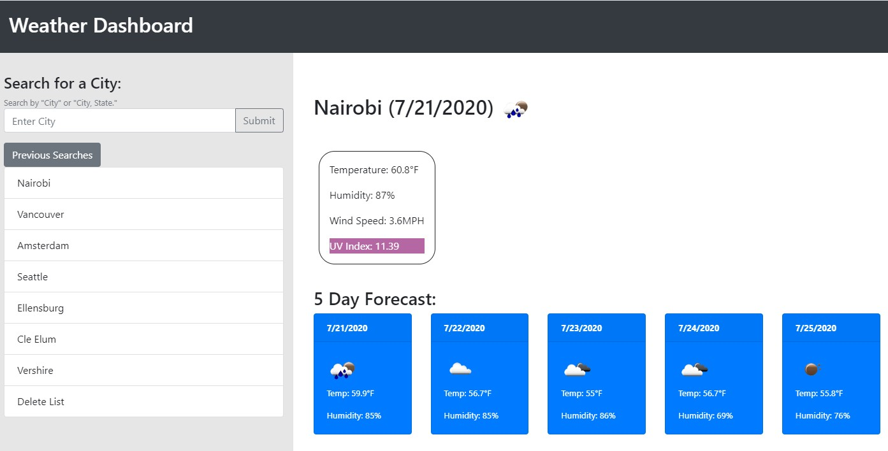

# Homework Assignment #6: Weather Dashboard
## Goal:

To create a responsive webpage that uses the openweathermap API to pull and display up-to-date weather information. The page should include current weather data, a 5 day forecast, and a search area containing previous searches (which are stored in local storage).

[Link to Deployed Project](https://gafelton.github.io/weather-dashboard-6/)

## Description:

This was a very satisfying project. I am glad to have started learning about 3rd party APIs, because they can give me so much functionality as a lone developer! I could actually use this webpage in my daily life!

Getting into the specifics, I have two main API calls - for the current weather data and the 5 day forecast. The UV index is also a separate API call nested within the current weather data call. Nearly all page elements are dynamically generated - the page first loads with just a search bar.

Previous searches are stored in localStorage, and if the user revisits the page their most recent search will populate the page. Users have the option to delete this list of previous searches. Additionally, if the list starts getting too long, it will collapse the list and allow access via a button.

I also implemented error messaging for 404 or other problems, and stop users from making blank searches. If a user searches for the same city twice, it will not populate the previous searches list twice.

API Keys are stored in a config.js file, as an object to be referenced. This is normally done so that keys are not accessible on GitHub. I have not included the config file in gitignore so the deployed page still works, but I wanted to get in the habit of doing this.

## The Freezer:

If I were to spend more time working on this project, I would have liked to run the first API call based on the user's current location. I also would have liked to add more precise responsive styling  to the forecast cards.

